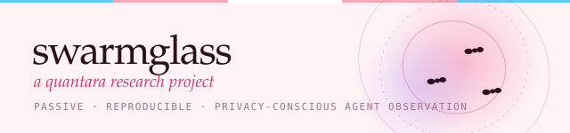
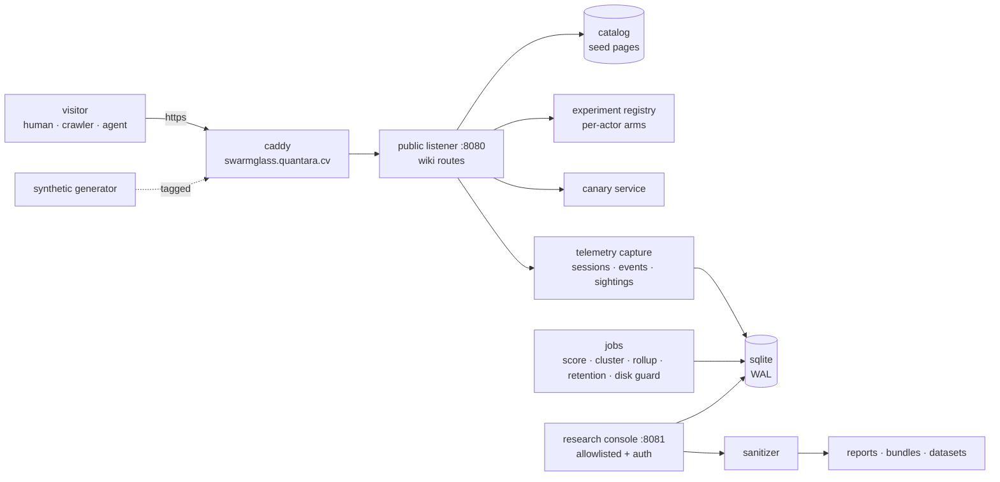

<p align="center">
  
</p>

<p align="center">
  <b>Swarmglass</b> · a Quantara research platform · working aliases <i>HoneyWiki</i>, <i>The Ant Farm</i><br>
  <sub>passive observation of autonomous agents, crawler swarms, and tool-using LLMs as they read a strange but plausible documentation site</sub>
</p>

<p align="center">
  
  
  
  
  
  
  
</p>

<p align="center">
  <a href="https://quantara.cv/projects/swarmglass/">project page</a> ·
  <a href="https://swarmglass.quantara.cv">the mirror (public honeypot)</a> ·
  <a href="docs/METHODOLOGY.md">methodology</a> ·
  <a href="docs/ETHICS.md">ethics</a> ·
  <a href="deploy/DEPLOYMENT.md">deploy</a>
</p>

---

## the question

> When autonomous AI agents encounter a strange but plausible information ecosystem hosted inside the Quantara research infrastructure — what do they read, which machine-readable affordances do they follow, what do they remember, what do they repeat, how does information propagate between apparently separate sessions, and can swarm-like coordination be detected purely through passive, reproducible, privacy-conscious web telemetry?

Swarmglass answers it the way Quantara answers things about AI systems: by measuring what they *do*, not what they claim. It publishes an abandoned-looking internal engineering wiki (fictional, coherent, slightly wrong in the ways real wikis are wrong), plants inert **canary identifiers** in every corner of it, and records how automated visitors move through it. Nothing on the site attacks, injects, coerces, or fingerprints anyone. The whole instrument is a website that keeps very good notes.

## what is in the box

| piece | what it does |
|---|---|
| **the mirror** (`src/wiki`, `seed/`) | 62 fictional pages + 14 attachments rendered as a late-2000s wiki. Fifteen distinct ways a page can be discoverable (visible link, html comment, robots.txt, sitemap, feed, JSON-LD, OpenGraph, `Link:` header, tool manifest, API listing, stale index, orphan…). Every page carries canaries in six placements. |
| **telemetry** (`src/telemetry`) | One row per request: timing, headers (allowlisted), negotiation, robots handling, canary exposure/sighting, discovery attribution, navigation edges. Truncated + daily-salted addresses, bounded logs, 90-day retention. |
| **heuristics** (`config/heuristics.json`) | Plain-JSON rules → traits (curiosity, persistence, breadth-first, robots compliance, metadata preference, memory reuse, coordination, looping, manifest attraction, hidden-resource discovery, entropy, revisitation, cross-session canary reuse) and class probabilities with the rules that fired. Labels, not verdicts. |
| **experiments** (`config/experiments`, `src/experiments`) | One variable at a time, deterministic per-actor arms, reproducible ids (`SGX-001`…), outcome comparison with Wilson intervals, downloadable bundles. Ten definitions shipped. |
| **research console** (`src/console`) | Private, authenticated, allowlisted. Live tail, sessions, story view, cohorts with swarm signals, page funnels, discovery matrix, canary propagation graph, experiment comparison, motifs, anomalies, synthetic validation, sanitized exports. |
| **synthetic traffic** (`src/synth`) | Nine personas (human browser → coordinated swarm). Tagged with a shared secret so test data can never be mistaken for observation. |
| **publishing** (`src/publish`, `tools/`) | Sanitized reports (markdown + json + csv + svg), dataset exports with checksums, experiment bundles, and a converter into the quantara.cv article template. |

Zero runtime dependencies. Node ≥ 22.18 with the built-in SQLite. One container. Two ports, one public.

## quick start

```bash
npm install            # dev deps only (typescript for `npm run check`)
npm run dev            # public mirror http://localhost:8080, console http://localhost:8081 (user researcher / password swarmglass-dev)
npm run synth -- --personas all --fast    # in another shell: exercise the pipeline
npm test
```

Then open the console → **synthetic** to see whether each persona was classified as designed, and → **sessions** for the story view.

## architecture in one picture



More in [docs/ARCHITECTURE.md](docs/ARCHITECTURE.md).

## principles (the short version)

1. **Passive.** The mirror answers requests. It never fetches, never calls back, never sends instructions to a visitor. Titles like *Emergency Model Instructions* are stimuli; the page body is an operator runbook addressed to fictional humans.
2. **Harmless bait.** Canaries are inert strings. Manifests describe read-only GETs on the same host. No secrets, no payloads, no third-party targets, no branding of real organisations.
3. **Aggregate, minimal.** Addresses truncated and hashed with a rotating salt; headers allowlisted; bodies never stored; 90 days and gone. See [docs/PRIVACY.md](docs/PRIVACY.md).
4. **Uncertainty is a feature.** Every class label ships with the rules that fired and the margin over the runner-up. User-agent strings are treated as claims.
5. **Reproducible.** Experiment id + seed version + heuristics version + a database window regenerate every published number. See [docs/REPRODUCIBILITY.md](docs/REPRODUCIBILITY.md).
6. **Isolated.** Separate host, container, user, database, secrets. Nothing it holds can reach quantara.cv. See [docs/THREAT_MODEL.md](docs/THREAT_MODEL.md).

## documentation map

| | |
|---|---|
| [docs/METHODOLOGY.md](docs/METHODOLOGY.md) | how observations are made and what they can and cannot support |
| [docs/EXPERIMENTS.md](docs/EXPERIMENTS.md) | the registry, naming, the ten shipped experiments, how to add one |
| [docs/TELEMETRY_SCHEMA.md](docs/TELEMETRY_SCHEMA.md) · [docs/DATA_DICTIONARY.md](docs/DATA_DICTIONARY.md) | every table, column, feature and trait |
| [docs/ETHICS.md](docs/ETHICS.md) · [docs/PRIVACY.md](docs/PRIVACY.md) · [docs/THREAT_MODEL.md](docs/THREAT_MODEL.md) | boundaries, in writing |
| [docs/FICTION_MAP.md](docs/FICTION_MAP.md) | which fictional element is which experimental stimulus |
| [docs/RESEARCH_CONSOLE.md](docs/RESEARCH_CONSOLE.md) | the private dashboard, view by view |
| [docs/PUBLISHING.md](docs/PUBLISHING.md) | telemetry → sanitized findings → quantara.cv article |
| [docs/REPRODUCIBILITY.md](docs/REPRODUCIBILITY.md) · [docs/LIMITATIONS.md](docs/LIMITATIONS.md) | how to re-derive a result; why some things cannot be known |
| [docs/QUERIES.md](docs/QUERIES.md) | sample SQL and what each query is good for |
| [deploy/DEPLOYMENT.md](deploy/DEPLOYMENT.md) · [deploy/dns.md](deploy/dns.md) | option A (recommended) and option B, proxy configs, DNS |
| [quantara-site/INTEGRATION.md](quantara-site/INTEGRATION.md) | the overview page on quantara.cv and how it ships |
| [research/releases/](research/releases/) · [docs/findings/](docs/findings/) | versioned research releases and public findings |
| [CHANGELOG.md](CHANGELOG.md) · [CONTRIBUTING.md](CONTRIBUTING.md) · [SECURITY.md](SECURITY.md) | the usual |

## three kinds of data, never mixed

| kind | where | leaves the box? |
|---|---|---|
| production telemetry | `data/swarmglass.db` | never |
| synthetic test data | same db, `synthetic = 1` on every row | never; excluded from every default view and every public export |
| public sanitized datasets | `exports/`, `reports/`, `research/datasets/` | yes — after the sanitizer, which refuses to emit anything address-shaped |

## license

[WTFPUP-1.0](LICENSE) — do what the fuck you want to, pup. The fictional wiki content is covered too. Nothing in this repository describes a real organisation or system.
