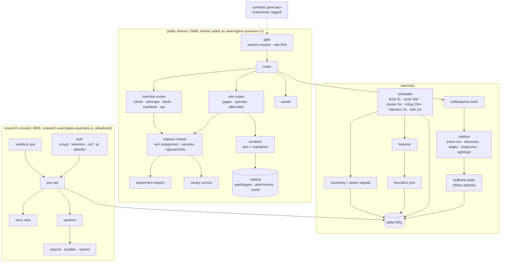

# Architecture

Swarmglass is one Node process with two HTTP listeners, one SQLite file, and no runtime dependencies. This document is the map.

## Components



## Request lifecycle (public)

1. **Parse.** `src/http/server.ts` builds a bounded `Req`: raw header order, first-value headers, cookies, normalized path (base path stripped), query, client ip resolved through trusted proxies only.
2. **Gate.** `Telemetry.gate` resolves the session (cookie → actor fingerprint within a 30-minute idle window → new; a session that memory has lost to a restart or an LRU eviction is rehydrated from the database while it is still inside that window), tags synthetic traffic if the shared token matches, and applies a token-bucket rate limit per truncated address. A 429 is itself a recorded event.
3. **Route.** The router matches the path. Every handler builds a `ReqCtx` (`src/wiki/context.ts`): the actor's experiment arms, the variables in force for the page, a canary factory (route-scoped or session-scoped), and the experiment-driven link injections for this page.
4. **Render.** The skin (`render.ts`) and markdown renderer produce HTML; the machine module produces robots/sitemaps/feeds/manifests. Every canary placed is pushed to `ctx.exposures`.
5. **Respond.** The server merges middleware headers (session cookie), sends, and calls `onResponse`.
6. **Capture.** One event row; session counters; first-discovery attribution (referer → channel → sequence → direct); navigation edges; canary exposures (first per session) and sightings (scanning path, query, headers, cookies, bounded body); a live-bus publish for the console tail.

## Data model

See `docs/TELEMETRY_SCHEMA.md`. In one line: `sessions` 1—n `events`; `page_discoveries` and `nav_edges` per session; `canaries` issued, `canary_exposures` (canary × session), `canary_sightings` (when one comes back); `clusters` over sessions; `experiment_runs` and `synthetic_runs` for provenance.

## Discoverability classes

Computed at boot from the seed (`content.ts`): a BFS over visible `[[links]]` from `Main_Page` gives depth and reachability; frontmatter `channels` says which machine lists name a page; the class is `visible`, `obscure` (linked only from unreachable pages like talk/archive), `comment_only`, `<channel>_only`, `multi_channel`, `orphan`, or `experiment` (exposure controlled by an arm). Under an experiment the *effective* class can differ per actor; events record the effective one.

## Experiments

`config/experiments/*.json` → `ExperimentRegistry`. One variable per definition; targets may not overlap between active experiments; at most one global-scope experiment at a time. Assignment is `fnv1a(salt | id | version | actorHash) mod Σweights`, so an actor keeps its arm across sessions and a version bump reshuffles deliberately. `src/wiki/context.ts` turns arms into concrete changes: injected links, robots/sitemap/feed entries, title/anchor text, banners, metadata density, JSON-LD presence, alternate ordering, canary scope, doc language blocks.

## Why these choices

- **Node + built-in SQLite, no dependencies.** The honeypot is an attack surface by definition; every dependency is code we did not read. Node ≥ 22.18 strips TypeScript and ships SQLite, so the whole thing runs from source in a 60 MB image on the ARM VM we already have.
- **Hand-rolled router and templates.** No template engine means no template evaluation of anything request-derived, ever. The renderer escapes by default; the seed is the only trusted input.
- **SQLite in WAL mode with a batching writer.** A crawl storm is a few hundred inserts a second at most; one transaction every 250 ms handles that with room to spare and keeps the read side (console) unblocked. Postgres would add a second process to secure for no gain at this scale.
- **Two listeners, one process.** The console shares the database file but nothing on the wire with the public side. The proxy is what keeps the console off the public hostname; the compose file keeps its port on loopback.
- **Deterministic everything.** Revision histories, canaries, arm assignment, synthetic personas: all seeded. A researcher can predict what a page looked like to an actor at a given time from the seed version and the actor hash.

## Where things are

```
src/
  app.ts            wires config → db → catalog → registry → telemetry → both servers → scheduler
  main.ts           entrypoint + signal handling
  config.ts         env-based config; production refuses to start without secrets
  http/             server, router, negotiation, security headers, rate limiting, malformation flags
  wiki/             catalog loader, markdown, skin, routes, specials, machine channels, alternates, history
  telemetry/        privacy transforms, sessions, canaries, capture, features, scoring, clustering, retention, jobs
  experiments/      registry + assignment, comparison, bundles
  console/          auth, api queries, story view, routes, ui/
  publish/          sanitizer, charts, report generator
  synth/            personas + runner
seed/               VERSION, world.json, pages/*.md, attachments/
config/             heuristics.json, experiments/*.json
tools/              cli entrypoints (npm run …)
tests/              node:test suites (unit + end-to-end over http)
deploy/             caddy / nginx / traefik / systemd / dns / install script
docs/               this folder
```
