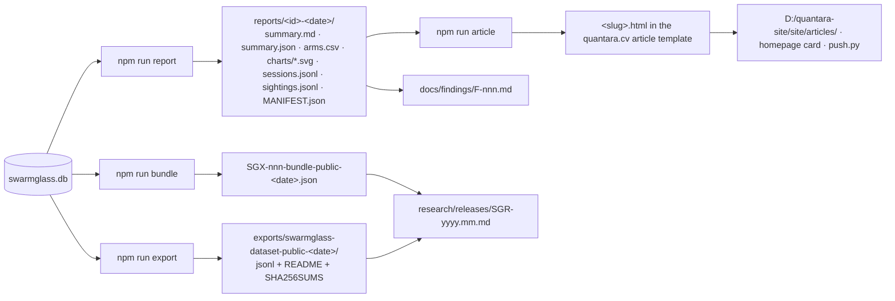

# Publishing pipeline

From telemetry to a Quantara article without a human ever pasting an address into a document.



## 1. Report

```bash
npm run report -- --experiment SGX-001 --range 30d           # experiment report
npm run report -- --range 7d                                  # general observation report
```

Writes `reports/<id>-<date>/`:

| file | content |
|---|---|
| `summary.md` | totals, class mix, hidden-page reach, canary placements, the experiment table with Wilson intervals, how-to-read notes |
| `summary.json` | the same numbers, machine-readable |
| `arms.csv`, `comparison.json` | per-arm outcomes |
| `charts/*.svg` | class mix, discovery matrix, hidden reach, canary placements, propagation graph, per-experiment reach / time-to-target CDF / class mix |
| `sessions.jsonl`, `sightings.jsonl` | sanitized rows behind the numbers |
| `canary_propagation.json` | the graph data |
| `MANIFEST.json` | sha256 of every file |

Everything passes `assertNoLeak` at public level; the command fails rather than writing a leaking file. `--level internal` exists for your own analysis and says so in every file.

## 2. Bundle

`npm run bundle -- --experiment SGX-001 --range 30d` → one JSON file with the frozen definition, the comparison, sanitized sessions, an event sample, provenance and a sha256. This is the artefact a reader cites.

## 3. Dataset

`npm run export -- --range 90d --level public` → a folder with `sessions.jsonl`, `events.jsonl`, `sightings.jsonl`, a README and `SHA256SUMS`. Session/actor ids are re-keyed per export; two exports cannot be joined, by design. Copy the folder into `research/datasets/` when it accompanies a release.

## 4. Finding

Write `docs/findings/F-nnn-<slug>.md` from `docs/findings/TEMPLATE.md`. State the experiment id, seed version, heuristics version, window, and which report folder the numbers came from. Observed behaviour goes under *What we observed*; anything about *why* goes under *Speculation* and stays there.

## 5. Article

```bash
npm run article -- --report reports/SGX-001-2026-10-01 --slug swarmglass-discovery-channels --title "Which door do crawlers use?" --summary "…"
```

Converts `summary.md` into the quantara.cv article template (`D:/quantara-site/templates/article.html` by default; pass `--template`), inlining the SVG charts as figure plates. The output is a starting point: edit the prose into an article, keep the tables and charts, then copy to `site/articles/<slug>.html`, add the card to the homepage `#think` list, and deploy with the site's own `push.py`. The article template's rules apply (every `<h2>` needs an id; charts live in `.viz-block`; no external requests).

## 6. Release

When a set of findings is published together: tag the repo `SGR-YYYY.MM`, add `research/releases/SGR-YYYY.MM.md` listing findings, bundles and datasets with their sha256s, and bump `research_release` in `quantara.project.json`.

## What must never be in a publication

Addresses in any form, session or actor ids from the database, user-agent strings, raw headers, query values, external referer hosts, exact timestamps at public level, synthetic rows mixed with real ones, or a claim about which model or operator produced a session. The sanitizer enforces the first six mechanically; the last two are yours.
