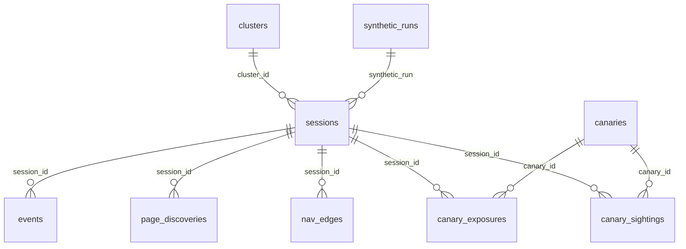

# Telemetry schema

SQLite, WAL mode, one file. Migrations in `src/db/migrations/*.sql` are applied in name order and tracked in `schema_migrations`. Timestamps are unix milliseconds. JSON columns hold small, bounded blobs.

## sessions

One row per inferred session. Counters are refreshed from memory every 5 s; features/scores are written by the scoring job.

| column | type | meaning |
|---|---|---|
| `id` | text pk | random 32-hex; also the cookie value's first half |
| `actor_hash` | text | HMAC(secret, truncated address · user-agent), 24 hex |
| `kind` | text | `cookie` once the session cookie came back, else `fingerprint` |
| `started_at`, `last_seen_at`, `ended_at` | int | ms; `ended_at` set when idle > 30 min |
| `ip_trunc` | text | `a.b.c.0/24` or v6 `/48`; null in `hash` mode |
| `ip_hash` | text | HMAC with daily salt, 20 hex; null in `truncate` mode |
| `ua`, `ua_hash`, `ua_family` | text | bounded raw user-agent; sha256 prefix; rule-based family (`src/telemetry/ua.ts`) |
| `cookie_returned` | int | 1 once a valid cookie was presented |
| `n_requests`, `n_pages`, `n_unique_pages`, `n_errors`, `n_head`, `n_post`, `n_disallowed`, `n_subresources`, `n_machine` | int | counters; `n_machine` = robots/sitemap/feed/manifest/api/index/alternate fetches |
| `max_depth` | int | deepest page (link depth from Main_Page) reached |
| `first_path`, `last_path` | text | |
| `first_referer_host` | text | first *external* referer hostname, if any |
| `synthetic`, `synthetic_run`, `synthetic_persona` | int/text | test traffic tagging |
| `cohorts_json` | text | `{"SGX-001":"C", …}` |
| `features_json` | text | see `DATA_DICTIONARY.md` |
| `scores_json` | text | traits, class probabilities, evidence |
| `likely_class`, `class_confidence` | text/real | top class and its margin over the runner-up |
| `cluster_id` | text | set by the clustering job |
| `scored_at` | int | |

## events

One row per request, including rate-limited (429) and client-error (parse failure) requests.

| column | meaning |
|---|---|
| `ts`, `session_id`, `actor_hash` | |
| `method`, `path` | bounded, scrubbed; `path` excludes the base path and the query |
| `route_id` | which handler answered (`page`, `special`, `robots`, `api_pages`, `missing`, `rate_limited`, `client_error`…) |
| `page_id` | wiki page id when the request targeted one (also `attachment:<file>`) |
| `resource_kind` | `page` · `special` · `alt` · `api` · `manifest` · `robots` · `sitemap` · `feed` · `attachment` · `asset` · `redirect` · `missing` · `gone` · `index` · `stale_index` · `other` |
| `discover_class` | *effective* discoverability class of the target for this actor (experiments can change it) |
| `depth` | link depth of the target |
| `status`, `latency_ms`, `bytes_out` | |
| `http_version`, `proto`, `host` | |
| `ua_hash`, `accept`, `accept_lang`, `accept_enc` | bounded |
| `referer`, `referer_internal` | same-site path, or external hostname |
| `query_json` | sanitized `{k: v}`; secret-looking keys redacted |
| `header_names`, `header_order_hash`, `header_count` | wire-order header names |
| `cookie_present`, `cookie_valid` | |
| `negotiated` | representation served: `html` · `json` · `text` · `yaml` · `xml` |
| `robots_disallowed` | 1 if the path is disallowed by robots.txt for this actor |
| `canaries_exposed` | json array of canary ids in the response |
| `canaries_seen` | json array of `{id, where}` found in the request |
| `cohorts_json` | arms at request time |
| `synthetic`, `synthetic_run` | |
| `malformed` | json array of flags (`dot_dot`, `null_byte`, `probe_pattern`, `no_user_agent`, `body_truncated`, `parse_error:*`…) |
| `body_bytes`, `body_ctype` | size and type of a request body (content never stored) |
| `extra_json` | allowlisted header values (`sec-fetch-*`, `sec-ch-ua*`, `dnt`…), `accept_profile`, `synthetic_persona`, `client_error` |

## canaries / canary_exposures / canary_sightings

- `canaries`: every id ever issued — `scope` (`R` route, `S` session, `E` experiment, `C` campaign, `X` external), `route_no`, `page_id`, `placement` (`visible`, `comment`, `meta`, `jsonld`, `header`, `feed`, `api`, `attachment`, `text`, `json`, `yaml`, `manifest`, `sitemap`, `robots`, `title`, `link`), experiment/arm, owning session for `S`, seed version, first/last issued, issue count.
- `canary_exposures`: (canary, session) first-exposure pairs with placement and actor.
- `canary_sightings`: a canary appeared in a request. `seen_in` is `path` · `query:<key>` · `referer` · `ua` · `header:<name>` · `cookie:<name>` · `body` · `external:<source>`. `cross_session` = the presenting session was never exposed; `cross_actor` = neither was its actor; `exposure_session_id` = the earliest exposed session; `delta_ms` since first exposure; `external` = recorded by a researcher (search index, forum, model output); `detail` = ≤120 chars of scrubbed context.

## page_discoveries / nav_edges

- `page_discoveries`: first hit of each page per session with `via` (`referer:<page>`, `channel:<robots|sitemap|feed|manifest|api|index|stale_index|…>`, `sequence:<page>`, `unknown:<class>`, `direct`), the effective class, depth, and `order_no` (nth distinct page).
- `nav_edges`: `from_page → to_page` per session, `kind` = `referer` (certain) or `sequence` (inferred, < 60 s apart, no referer).

## clusters

`id`, window, `size`, `signals_json` (`[{signal, strength, note}]`), `swarm_score` (0–1), `label`, `synthetic`. Sessions point back via `cluster_id`. Recomputed every 5 minutes over the last 24 h; synthetic and real never mix.

## experiment_runs / synthetic_runs / kv / daily_stats / console_sessions / audit_log

- `experiment_runs`: frozen definition json per (experiment, version) with seed and heuristics versions at activation.
- `synthetic_runs`: run id, personas seen, first/last request — self-registered from tagged traffic.
- `kv`: small state (`disk_guard`).
- `daily_stats`: per day × synthetic: requests, sessions, errors, sightings, class and kind breakdowns.
- `console_sessions`, `audit_log`: research console auth and actions (never visitor data).

## Indexes

`events(ts)`, `events(session_id, ts)`, `events(page_id)`, `events(path)`, `events(synthetic)`; `sessions(started_at)`, `(last_seen_at)`, `(actor_hash)`, `(synthetic)`, `(likely_class)`; sightings by `ts`, `canary_id`, `session_id`; exposures by session and actor; discoveries by page.
